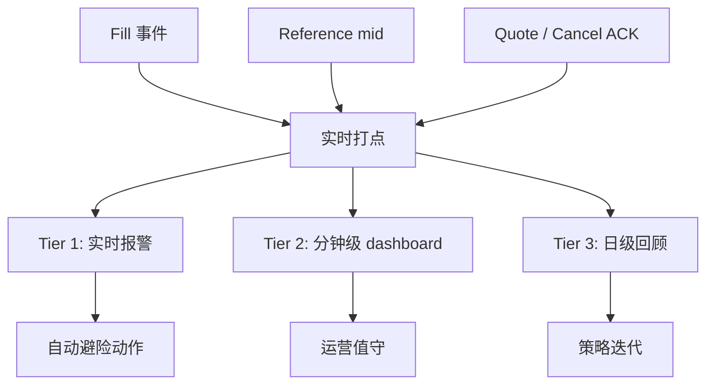
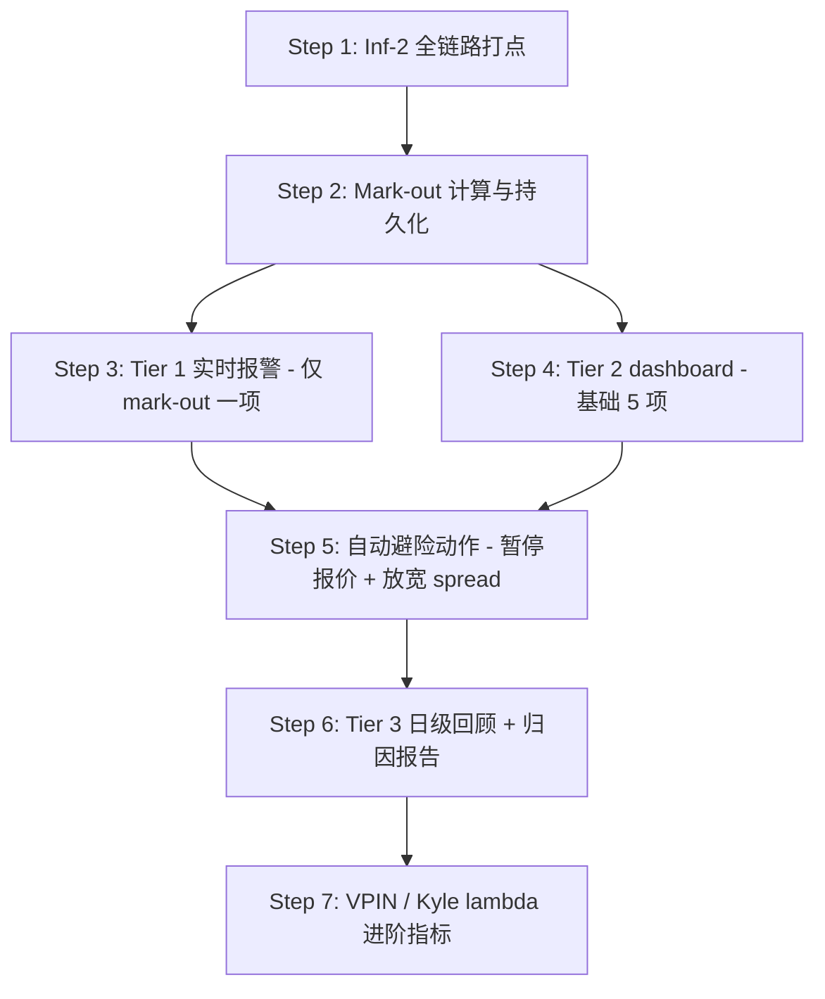

# 逆向选择（Adverse Selection）：原理、量化与监控

> 加密现货做市最核心的风险来源。本报告覆盖理论框架、市场场景、量化指标、监控体系与缓解策略。
> 适用阶段一：单 symbol、单交易所（target）+ 单参考所（reference）的现货做市。

---

## 1. 概念与本质

### 1.1 一句话定义

**逆向选择**：做市商挂出的报价被"信息上比自己更快/更准"的对手成交，导致这笔成交在 mark-to-market 意义上立刻为负 PnL。在做市文献里也叫 **adverse selection cost**，被吃的成交称为 **toxic fill**。

### 1.2 信息不对称的来源

经典 Glosten-Milgrom 框架把市场参与者分成两类：

| 类型 | 行为 | 对 MM 的影响 |
|---|---|---|
| **Uninformed flow（噪声交易者）** | 出于流动性需求随机买卖 | MM 的 PnL 来源，提供 half-spread |
| **Informed flow（知情交易者）** | 持有短期价格预测优势 | MM 的 PnL 流失项，吃的瞬间 MM 即亏 |

做市商无法事前区分对手身份，**只能事后从成交分布统计**。这正是"逆向选择"名字的来源——你倾向于成交那些**对你不利的**单子。

### 1.3 单笔 toxic fill 的损失公式

经典 Glosten-Milgrom：

$$
\mathbb{E}[\text{loss} \mid \text{toxic fill}] \;\approx\; \mathbb{E}[\Delta_{\text{info}}]
$$

其中 $\Delta_{\text{info}}$ 是 informed trader 已经看到、但 MM 尚未在报价中反映的信息所对应的价格移动。

加密现货实测经验值（BTC/USDT、ETH/USDT 类主流对）：

| 市场状态 | 单笔 mark-out @ 1s | 占 spread 比例 |
|---|---|---|
| 平静（σ 低） | −0.3 ~ −0.5 tick | ~0.5 × spread |
| 正常波动 | −0.5 ~ −1.0 tick | ~1.0 × spread |
| 高波动 / 新闻 | −2 ~ −10 tick | 3–20 × spread |
| 闪崩 / 极端事件 | −50 ~ −500 tick | 数量级 toxic |

### 1.4 做市盈利的基本模型

$$
\mathbb{E}[\text{PnL}] \;=\; N_u \cdot \tfrac{s}{2} \;-\; N_i \cdot \mathbb{E}[\Delta_{\text{info}}] \;+\; (N_u+N_i)\cdot r_{\text{fee}}
$$

- $N_u, N_i$：uninformed / informed 成交数
- $s$：报价 spread
- $r_{\text{fee}}$：maker rebate（OKX/Binance 通常为负即返佣）

**核心洞察**：做市商赚不赚钱不取决于 spread 设多宽，而是取决于 $N_i / N_u$（toxic ratio）。Spread 收入是稳定的小钱，toxic loss 是偶发的大钱。

---

## 2. 加密现货市场中的逆向选择来源

按 toxicity 强度由低到高排列：

### 2.1 跨所套利者（Cross-venue arb，最常见）

```
场景：你在 OKX 报价，参考 Binance 价
T=0    Binance mid: 50000 → 50010（某 whale 买入）
T=2ms  Binance 上的套利机器人看到价差
T=3ms  套利机器人下单吃你的 OKX ask @ 50002
T=50ms 你的 fair price 才从 Binance feed 更新到 50010
T=52ms 你才想撤单，已经晚了 49ms
```

**特点**：
- 频率高，几乎每个 reference 跳价都触发
- 单笔损失中等（1–3 × spread）
- 但出现频率高 → **累计是 toxic loss 的最大来源**

**缓解关键点**：缩短"reference 跳价 → target 撤单 ACK"的总延迟。这是 [Ex-1] 部署位置成为性价比之王的根本原因。

### 2.2 HFT taker 策略

某些 HFT 跑的不是套利，而是 **momentum / order flow prediction**：
- 看到 aggTrade 连续同向 → 预判后续会延续 → 主动吃 MM 报价
- 看到 OBI 极度失衡 → 预判 best 会被吃穿 → 抢在你撤单前下单

**特点**：
- 中等频率
- 中等损失（1–5 × spread）
- 对 spread 不敏感（他们要的是方向 alpha，不在乎付 spread）

### 2.3 大单冲击（block trade / iceberg）

大客户分批下单或 iceberg 单：
- 第一笔吃了 best ask → 你看到深度变化
- 但客户后面还有 9 笔同方向单要打
- 你重挂的 ask 又被吃，**连续被同方向吞噬**

**特点**：
- 单笔损失大（5–20 × spread）
- 持续时间几秒到几分钟
- aggTrade 的连续同向信号是早期识别关键

### 2.4 新闻 / 公告驱动

CPI 数据、SEC 公告、ETF 流入、交易所列币：
- T=0 新闻发布
- T=10–500ms 新闻订阅机器人下单
- T=500ms–2s 人类交易者反应

**特点**：
- 频率低
- 单次极致 toxic（10–100 × spread）
- 必须用市场状态检测 + 主动撤单避险

### 2.5 Insider / 内幕信息（rare 但致命）

交易所将列币公告前的异常买入、项目方利空发布前的卖压。

**特点**：
- 极低频
- 单次损失可吃掉一周 PnL
- **几乎无法事前防御**，只能事后用 mark-out 监控发现并复盘

---

## 3. 量化指标体系

按时效性与计算复杂度分层：

### 3.1 Mark-out PnL（核心指标，必须有）

成交后 $\tau$ 时间窗口内，mid 价朝有利方向还是不利方向移动。

```python
def markout(fill, horizon_ms):
    """
    fill.side: 'buy' = MM 报 bid 被吃（MM 买入），'sell' = MM 报 ask 被吃（MM 卖出）
    返回单位：tick 数（或 bps）
    正数 = 有利方向（MM 赚），负数 = toxic
    """
    mid_at_fill = mid_at(fill.ts)
    mid_after = mid_at(fill.ts + horizon_ms)
    if fill.side == 'buy':
        return mid_after - mid_at_fill  # 买入后 mid 涨 = 赚
    else:
        return mid_at_fill - mid_after  # 卖出后 mid 跌 = 赚
```

**关键参数**：
- $\tau \in \{100\text{ms}, 1\text{s}, 10\text{s}, 60\text{s}\}$ 多窗口同时算
- mid 用 reference 的 mid（更可信，受 MM 自身影响小）
- 单位用 tick 或 bps，便于跨 symbol 对比

**解读**：
- 平均 $\geq 0$：健康做市，主要吃 noise flow
- 平均 $\in [-0.3, 0]$ tick：正常 toxic 水平，靠 fee rebate 覆盖
- 平均 $< -0.5$ tick：**报警，撤单跟不上**
- 短窗口 $\tau=100\text{ms}$ 急剧恶化：**说明 [Ex] 路径有问题**
- 长窗口 $\tau=60\text{s}$ 恶化但短窗正常：**说明被大单冲击吃了**

### 3.2 Realized Spread vs Quoted Spread

$$
\text{quoted spread} = \text{ask} - \text{bid}
$$

$$
\text{realized spread}(\tau) = 2 \cdot \text{markout}(\tau) + \text{fee rebate}
$$

直觉：
- Quoted spread 是你"理论上能赚的"
- Realized spread 是你"实际赚到的"
- 两者差距就是 **adverse selection cost**

健康水平：$\text{realized}/\text{quoted} \in [0.3, 0.6]$。若 $< 0.2$，spread 收入大头被 toxic 吃掉。

### 3.3 Toxic Fill Ratio

按 mark-out 符号分类：

$$
\text{toxic\_ratio}(\tau) = \frac{|\{\text{fill} : \text{markout}_\tau < -\theta\}|}{N_{\text{fills}}}
$$

阈值 $\theta$ 通常取 0.5 tick 或 1 tick。

实战参考：
- BTC/USDT spot，部署在 target 同区域，撤单延迟良好：**toxic ratio @ 1s ≈ 15–25%**
- 同上，但部署在跨区域（如家庭宽带）：**toxic ratio > 50%**，几乎做不下去

### 3.4 VPIN（Volume-Synchronized Probability of Informed Trading）

学术界标准指标，把成交按 volume 等分桶，计算每桶内 buy/sell 不平衡度：

$$
\text{VPIN} = \frac{1}{n}\sum_{i=1}^{n}\frac{|V_i^B - V_i^S|}{V_i^B + V_i^S}
$$

其中 $V_i^B, V_i^S$ 是第 $i$ 个 volume bucket 内的 buy/sell taker 量。

**解读**：
- $\text{VPIN} \in [0, 1]$
- $> 0.4$：toxicity 升高，应主动放宽 spread 或暂停报价
- $> 0.6$：建议直接撤所有单观望

**优点**：领先指标，在 mark-out 表现出来之前能预警。
**缺点**：计算复杂，对桶大小敏感，Phase 1 可作为 Tier-2 指标实现。

### 3.5 Kyle's Lambda（价格冲击系数）

$$
\Delta p = \lambda \cdot \text{net order flow}
$$

回归 reference mid 移动 vs 同窗口内 net taker volume，斜率 $\lambda$ 越大说明市场对 order flow 越敏感、informed 比例越高。

**用途**：
- 长期趋势监控（每日/每小时）
- 跨市场对比（哪个 symbol toxic 高）
- Phase 2 可作为 GLT 模型 $A, k$ 校准的辅助输入

### 3.6 延迟分位数（前置必要条件）

没有 [Inf-2] 全链路打点，所有上面指标都解释不动。最低限度：

| 打点 | 路径 | 报警阈值 |
|---|---|---|
| `reference_event_ts → fair_price_ts` | [Px] | P99 > 50ms |
| `fair_price_ts → decision_ts` | 策略 | P99 > 5ms |
| `decision_ts → target_ack_ts` | [Ex] | P99 > 50ms |
| `decision_ts → cancel_ack_ts` | [Ex] | P99 > 30ms |

**强约束**：延迟监控未上线前，禁止讨论"toxic ratio 为什么高"——你根本不知道时间花在哪。

---

## 4. 监控体系设计

按响应时效分三层。

### 4.1 架构总览



### 4.2 Tier 1：实时报警（秒级）

**目的**：在 toxic 持续吃单时立即触发自动避险，防止 PnL 雪崩。

| 指标 | 计算窗口 | 触发条件 | 自动动作 |
|---|---|---|---|
| Mark-out @ 1s 滚动均值 | 最近 30 fills | $< -1$ tick | 放宽 spread 2× |
| Mark-out @ 1s 滚动均值 | 最近 30 fills | $< -3$ tick | 暂停报价 30s |
| 连续同向 fill 数 | 最近 10 fills | 全部同向 | 反向 skew 强化 |
| Reference-target mid divergence | 实时 | $>$ 阈值 | 撤所有单 |
| Cancel ACK 延迟 P99 | 1min | $> 100\text{ms}$ | 降低报价频率 |

**实现要点**：
- 用 ring buffer，禁止每次扫全表
- 计算在异步任务里做，不阻塞主事件循环
- 触发动作必须幂等（同一报警重复触发不能重复挂/撤单）

### 4.3 Tier 2：分钟级 Dashboard（运营层）

**目的**：人类值守监控，发现趋势异常。

```
┌──────────────────────────────────────────────────────────────┐
│ Symbol: BTC/USDT          Last update: 12:34:56              │
├──────────────────────────────────────────────────────────────┤
│ Quoted spread:    2.1 tick      Realized spread:  0.8 tick   │
│ Toxic ratio @1s:  22%           Toxic ratio @10s: 31%        │
│ Mark-out @1s:    -0.4 tick      Mark-out @10s:   -0.7 tick   │
│ VPIN:             0.28          λ (Kyle):         0.0012     │
├──────────────────────────────────────────────────────────────┤
│ Fills (last 1m):  47            Cancel rate:      94%        │
│ Avg cancel ACK:   18ms (P99 41ms)                            │
│ Avg quote ACK:    12ms (P99 28ms)                            │
├──────────────────────────────────────────────────────────────┤
│ Inventory:        +0.34 / 1.0   Net PnL (1h):    +$143       │
└──────────────────────────────────────────────────────────────┘
```

必备图表：
1. Mark-out 时间序列（多窗口叠加）
2. Toxic ratio 滚动 5min
3. Quoted vs Realized spread 走势
4. 延迟分布（histogram，cancel/quote 分开）
5. Fill 方向分布 vs Inventory 走势

### 4.4 Tier 3：日级回顾分析

**目的**：策略迭代，发现长期 toxic 模式。

输出物：

**A. 每日 toxic 归因报告**
- Toxic fills 按时间分布（是否集中在某些小时？）
- Toxic fills 按 reference 跳价幅度分类（小跳价 toxic 占比 vs 大跳价）
- 单笔 toxic top 10：复盘当时 reference / target 价格、延迟、订单簿快照

**B. 延迟归因报告**
- 端到端延迟分位数走势
- 各段延迟（[Px] / 策略 / [Ex]）占比
- 异常 spike 时间点对应的 fill mark-out

**C. 跨小时/跨日 toxic ratio 对比**
- 找出高 toxic 时段（典型：US open、CN 早盘、大新闻发布前后）
- 对应时段是否应主动降低参与度

### 4.5 打点数据 schema（实现层最低要求）

```python
@dataclass
class FillEvent:
    ts: int                     # ns，本地接收时间
    target_ts: int              # 交易所撮合时间戳
    symbol: str
    side: str                   # 'buy' / 'sell'（MM 视角）
    price: float
    qty: float
    fee: float                  # 含 rebate（负数为返佣）
    order_id: str
    quote_ts: int               # 当初挂单的 decision_ts
    fair_price_at_quote: float  # 挂单时的 fair price
    fair_price_at_fill: float   # 成交时的 fair price
    queue_pos_estimate: float   # 成交前估计的队列位置

@dataclass
class MidSample:
    ts: int
    symbol: str
    venue: str                  # 'binance' / 'okx' 等
    mid: float
    bid: float
    ask: float
```

`fair_price_at_quote/fill` 字段是 mark-out 计算的关键，**挂单和成交两个瞬间都要记**，否则事后算 mark-out 没数据可用。

---

## 5. 缓解策略

按效果排序（已与 CLAUDE.md 的 Tier 表对齐）：

### 5.1 [Ex-1] 部署位置（10–100×，最有效）

把节点放在 **target 同区域**，把 reference→target 决策→撤单链路从 80ms 压到 5ms。这是其他所有优化的前提。

### 5.2 [Ex-2] 撤单通道与原子操作

- 撤单走 WebSocket API（Binance）/ private trade WS（OKX）
- 改单用 `cancelReplace`（Binance）/ `amend-order`（OKX）原子操作，避免 cancel→ack→new 的双 RTT
- Ed25519 签名（Binance）

### 5.3 aggTrade 预撤

在 [Px] 路径用 aggTrade 短路触发撤单，不等下一个 depth@100ms：

```python
on_aggtrade(trade):
    direction = -1 if trade.is_buyer_maker else +1
    fair_price_delta = trade.qty * direction * impact_coef
    if abs(fair_price_delta) > requote_threshold:
        cancel_stale_quotes()  # 不等 depth
```

### 5.4 Spread 自适应

触发条件 → 立即放宽 spread：

| 信号 | 放宽倍数 |
|---|---|
| 短窗 σ 突增 > 2× 均值 | ×1.5–2 |
| Reference-target mid divergence > 3 tick | ×2 |
| 连续 5 笔同向 aggTrade | ×1.5 |
| VPIN > 0.4 | ×2 |
| VPIN > 0.6 | 暂停报价 |

GLT 引擎里 $\sigma$ 与 $A$ 的滚动校准已经隐式包含一部分自适应，但极端事件需要离散触发。

### 5.5 Inventory Skew

被持续吃 ask（库存变 short）→ 自动上移整个报价中心：

$$
\text{quote\_center} = \text{fair\_price} - \alpha \cdot q_{\text{norm}}
$$

GLT 公式已包含 skew 项，参数 $\alpha$ 与 $\gamma$ 相关。Phase 1 起步可以用线性近似，到 Phase 2 切到完整 GLT。

### 5.6 Ladder 报价结构

最内层小量、外层大量，被 toxic 吃只吃到小量：

```
ask3: 50010 @ 0.5 BTC  ← 远档大量
ask2: 50006 @ 0.3 BTC
ask1: 50003 @ 0.1 BTC  ← 近档小量（toxic 防御层）
mid:  50000
bid1: 49997 @ 0.1 BTC
bid2: 49994 @ 0.3 BTC
bid3: 49990 @ 0.5 BTC
```

详见 [doc/ladder.md](./ladder.md)。

---

## 6. Phase 1 实施路线

按依赖顺序，**不要跳步骤**：



### 6.1 Step 1（前置必做）：打点

没打点就没数据，没数据上面所有都是空谈。最低限度：

- `FillEvent` 全字段
- `MidSample`：reference + target 各一份，1Hz 采样
- 所有 WS frame 收取时间、解析完成时间、决策完成时间、ACK 接收时间

存储建议：本地 parquet 滚动文件，按小时切。日志大小估算：每个 symbol 每天约 50MB，Phase 1 单 symbol 完全可控。

### 6.2 Step 2：Mark-out 计算

离线 batch（每小时跑一次）即可起步，**不要一开始就追求实时**。先确认指标本身有意义，再考虑搬到实时路径。

### 6.3 Step 3：单一报警先上线

只上 "mark-out @ 1s 滚动 30 fills 均值 < −1 tick 暂停报价" 一条。
观察一周，确认报警有效且 false positive 不高，再加其他规则。

### 6.4 Step 4–7：见 Mermaid 路线图

每一步上线前必须能回答：
- 这一步解决什么问题？
- 上一步的产出物是否已稳定？
- 失败 / 误报的 fallback 是什么？

---

## 7. 常见踩坑

| 坑 | 后果 | 规避 |
|---|---|---|
| 用 target 自己的 mid 算 mark-out | MM 自己的报价影响 mid，指标自我反馈 | **用 reference mid** |
| Mark-out 只看 1s 窗口 | 漏掉大单冲击型 toxic | 多窗口同时跑 |
| 报警阈值用绝对数 | 不同 symbol / 不同时段不适用 | 用相对值（× spread 或 bps） |
| 触发避险后不衰减 | 一旦报警就永久停摆 | 加 cooldown + 自动恢复 |
| Toxic ratio 没拆 buy/sell | 单边 toxic（如全在 bid 端被吃）被平均掉 | 双边分别统计 |
| 没记 `fair_price_at_quote` | 事后无法重建挂单时的预期 | 挂单瞬间就要打点 |
| 把延迟优化放在指标搭建之前 | 不知道瓶颈在哪，盲目优化 | 先打点，再优化 |
| 单一指标驱动决策 | 任何指标都有 blind spot | Mark-out + VPIN + 延迟三角验证 |

---

## 8. 与其它模块的关系

- **GLT 引擎** ([glt_spread.md](./glt_spread.md))：toxic 上升时 $\sigma$ 自动放大，spread 被动放宽；本报告的离散触发是对 GLT 连续校准的兜底。
- **Ladder 引擎** ([ladder.md](./ladder.md))：toxic 防御的结构性手段，近档小量。
- **OMS / 撤单链路** ([spec_infra.md](./spec_infra.md))：决定 [Ex] 路径延迟，是 toxic ratio 的物理上限。
- **回测引擎**：mark-out 计算逻辑必须线上线下一致，否则策略迭代结论不可信。

---

## 9. 参考文献

- Glosten, L. R., & Milgrom, P. R. (1985). *Bid, ask and transaction prices in a specialist market with heterogeneously informed traders.*
- Easley, D., López de Prado, M., & O'Hara, M. (2012). *Flow toxicity and liquidity in a high-frequency world.* (VPIN 原始论文)
- Cartea, Á., Jaimungal, S., & Penalva, J. (2015). *Algorithmic and High-Frequency Trading.* Cambridge. (Ch. 7 逆向选择章节)
- Hummingbot 团队博客：*Adverse selection in crypto market making*（实战视角）

