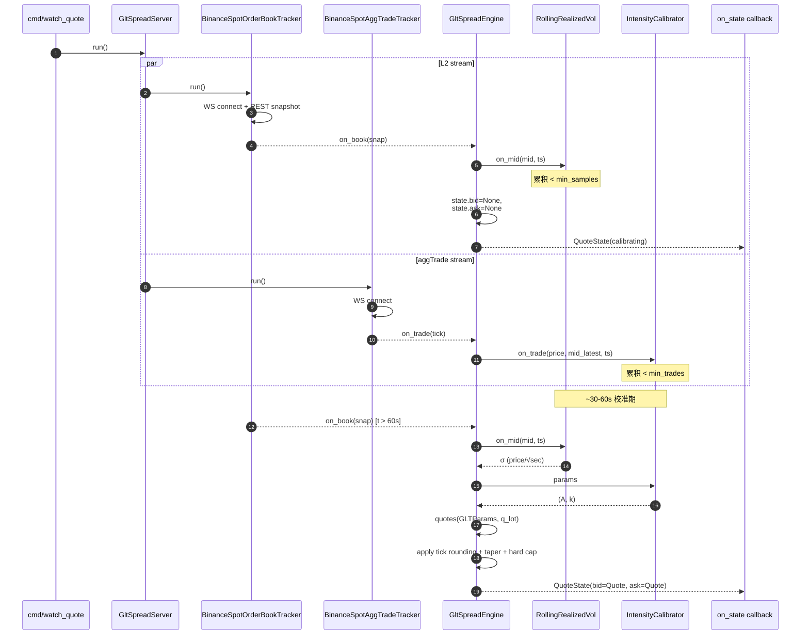
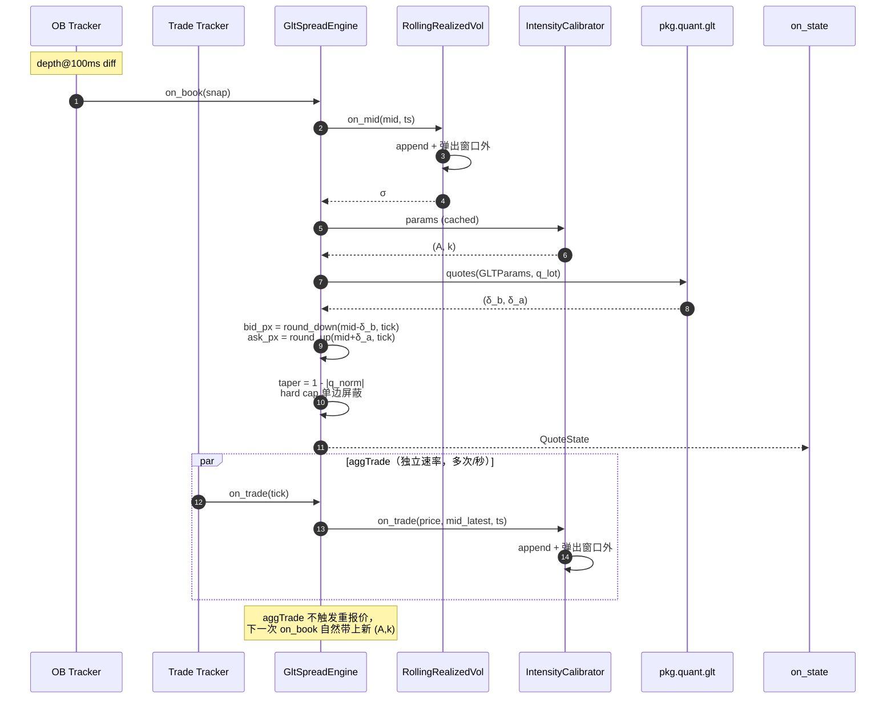
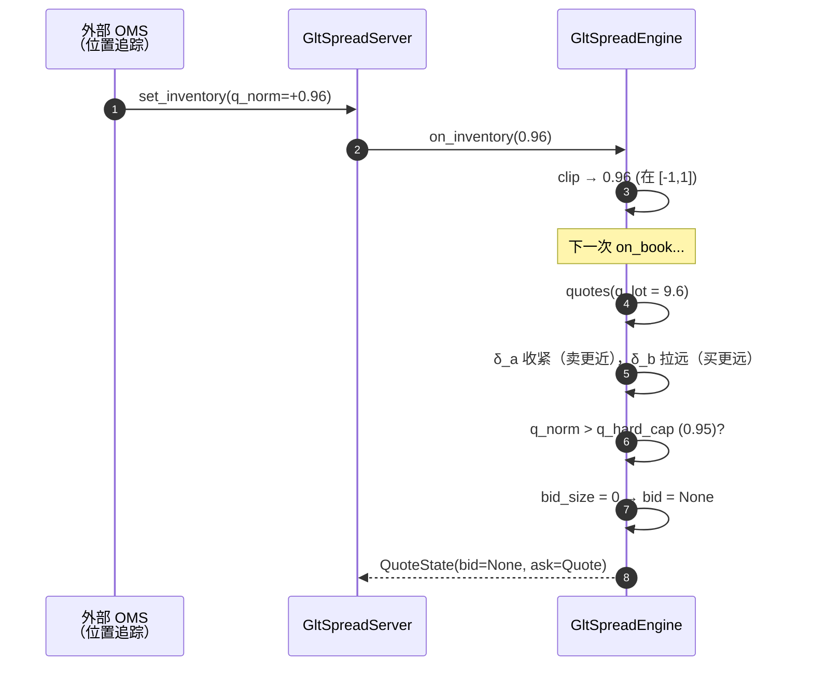
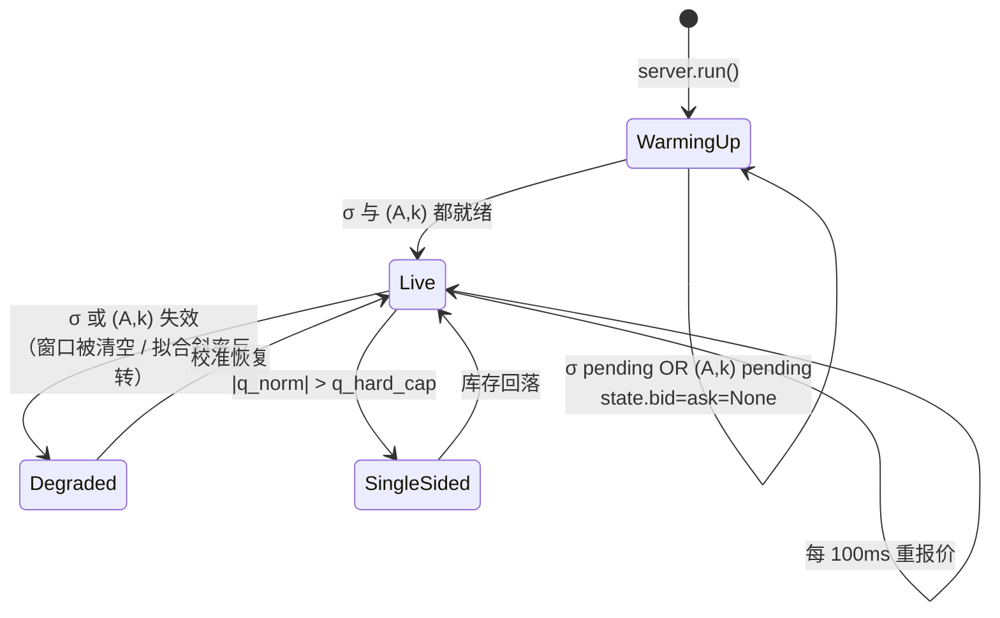

# GLT 价差引擎设计与实现

> Cartea-Jaimungal（Guéant-Lehalle-Tapia）稳态闭式解在单交易所现货做市的落地。
> 适用阶段一：单 symbol、单交易所、不含衍生品。

---

## 1. 数学模型

### 1.1 公式

库存 $q$（lot 单位）的最优买/卖距 mid 距离：

$$
\delta^{b*}_\infty(q) \;\approx\; \tfrac{1}{\gamma}\ln\!\Big(1+\tfrac{\gamma}{k}\Big) \;+\; \tfrac{2q+1}{2}\,u(\sigma,\gamma,k,A)
$$

$$
\delta^{a*}_\infty(q) \;\approx\; \tfrac{1}{\gamma}\ln\!\Big(1+\tfrac{\gamma}{k}\Big) \;-\; \tfrac{2q-1}{2}\,u(\sigma,\gamma,k,A)
$$

$$
u(\sigma,\gamma,k,A) \;=\; \sqrt{\tfrac{\sigma^2 \gamma}{2 k A}\,\Big(1+\tfrac{\gamma}{k}\Big)^{1+k/\gamma}}
$$

总价差 $\psi^*(q)=\delta^{b*}+\delta^{a*}=(2/\gamma)\ln(1+\gamma/k)+u$，**与 $q$ 无关**（库存只决定偏斜，不决定总宽度）。

最终挂单价：

```
bid_px = mid - δ_b
ask_px = mid + δ_a
```

### 1.2 参数语义与单位

| 参数 | 含义 | 单位 | 来源 |
|------|------|------|------|
| $\gamma$ | 风险厌恶系数 | $1/\text{price}$ | 外生，YAML 配置 |
| $\sigma$ | mid 价格波动率 | $\text{price}\cdot \text{sec}^{-1/2}$ | 校准（30s 滚动） |
| $A$ | 强度尺度（零距离 fill rate） | $\text{trades}\cdot \text{sec}^{-1}$ | 校准（aggTrade） |
| $k$ | 强度衰减 | $1/\text{price}$ | 校准（aggTrade） |
| $q$ | 库存（lot 数） | 无量纲 | 外部注入 $q_{\text{norm}}$，引擎转换 $q_{\text{lot}}=q_{\text{norm}}\cdot Q_{\max}$ |

**单位一致性是公式正确性的前提**。`σ` 必须是 price units per √sec，不是 log-return std；本实现在 `RollingRealizedVol.sigma` 内乘以 `mid_latest` 做转换。

### 1.3 库存约定

外部使用 $q_{\text{norm}}\in[-1,1]$（base 仓位/最大仓位归一化），引擎内部转换为 lot 单位：

```
q_lot = q_norm × Q_max
```

`Q_max` 是**建模参数**（决定库存对价差偏斜的灵敏度），`q_hard_cap` 是**风控参数**（决定何时单边停报）。两者职责不同。

---

## 2. 模块架构

```
pkg/quant/                     ← 纯数学，零 I/O，可单测、可移植
├── glt.py                     ← 闭式解：reservation_half_spread / inventory_skew_unit / quotes
├── vol.py                     ← RollingRealizedVol（σ 校准）
└── intensity.py               ← IntensityCalibrator（A、k 校准）

biz/domain/
├── trade.py                   ← TradeTick
└── quote.py                   ← Quote / QuoteState

biz/usecase/glt_spread.py      ← GltSpreadEngine：编排校准 + 公式 + sizing

biz/repo/trade.py              ← TradeStreamRepo 抽象

data/trade/binance_spot.py     ← BinanceSpotAggTradeTracker（WS @aggTrade）

config/__init__.py             ← SpreadConfig 字段

server/glt_spread_server.py    ← 编排 OB tracker + trade tracker + engine

cmd/watch_quote.py             ← demo runner
```

**分层契约**：
- `pkg/quant/` 只做计算，不持有 I/O 或状态机
- `biz/usecase/` 持有状态机，编排校准器与公式，**不打 metrics**（保持 hot path 干净）
- `data/` 实现 `biz/repo/` 协议，做 WS/REST
- `server/` 把 data 喂给 usecase

---

## 3. 时序图

### 3.1 启动到首次报价（冷启动）



### 3.2 稳态运行（每 100ms 一拍）



### 3.3 库存更新与硬上限



---

## 4. 校准算法

### 4.1 σ：滚动实现波动率

输入：mid 序列 $\{(t_i, P_i)\}$。

$$
r_i = \ln(P_i / P_{i-1}), \quad
\text{RV} = \sum_{i=2}^{N} r_i^2, \quad
\sigma^2_{\log} = \text{RV} / \Delta T_{\text{total}}
$$

按观测窗口长度归一化以正确处理不规则采样。最终 price 单位：

$$
\sigma_{\text{price}} \;\approx\; \sigma_{\log} \cdot P_{\text{latest}}
$$

**门槛**：默认窗口 30s，最少 30 个样本才返回有效 σ；否则 `sigma=None`。

### 4.2 (A, k)：Avellaneda-Stoikov survival-function 法

> 选择 survival method 而非 histogram binning：log-spaced bin 的几何中心对指数分布数据有系统性偏差（实测 k 偏低 40%）。

输入：aggTrade 距离序列 $\{\delta_i\}$（bps 单位），$\delta_i = |P^{\text{trade}}_i - P^{\text{mid}}_i| \cdot 10^4 / P^{\text{mid}}_i$。

对一组阈值 $\{\delta_t\}=\{0.5, 1, 2, 4, 8, 16, 32, 64\}$ bps，计算：

$$
\hat{\lambda}(\delta_t) = \tfrac{\#\{i : \delta_i \geq \delta_t\}}{T_{\text{obs}}}
$$

OLS 拟合：

$$
\log \hat{\lambda}(\delta_t) = \log A - k_{\text{bps}} \cdot \delta_t
$$

转 price 单位：$k_{\text{price}} = k_{\text{bps}} \cdot 10^4 / \bar{P}$，其中 $\bar{P}$ 是窗口内 mid 均值。

**门槛**：
- 窗口 60s（默认）
- 最少 50 笔 trade
- 至少 3 个阈值有 ≥5 笔统计
- 拟合斜率必须为负（正斜率 = 数据异常，返回 None）

---

## 5. Sizing 与风控

```python
taper = max(0.0, 1.0 - abs(q_norm))      # 库存接近上限时线性递减
base_size = lot_size * taper

bid_size = base_size if q_norm < q_hard_cap  else 0.0
ask_size = base_size if q_norm > -q_hard_cap else 0.0
```

| q_norm | bid size | ask size | 说明 |
|--------|----------|----------|------|
| 0.0 | lot_size | lot_size | flat：两边对称 |
| +0.5 | 0.5·lot | 0.5·lot | 仓位收 50%，size 减半，**报价不对称**（在公式里偏斜） |
| +0.95 | 0 | 0.05·lot | 触发硬上限：停买，只卖 |
| -0.95 | 0.05·lot | 0 | 反向硬上限 |

**Cross-quote 警告**：若 $\delta_b<0$ 或 $\delta_a<0$（公式要求穿过 mid），记 `glt_quote_cross` warning 并停报该侧。这是 $\gamma/Q_{\max}/\sigma$ 严重失配的信号，需要操作员调参。

---

## 6. 冷启动语义



引擎**永远不会**为了"出报价"而填充默认/上次的 σ、A、k 值。校准未就绪就停报，是阶段一的基本纪律。

---

## 7. 配置（`etc/nano-mm.yaml`）

```yaml
spread_engine:
  gamma: 0.1                # 风险厌恶（1/price）
  Q_max: 10.0               # 建模参数：q_lot = q_norm × Q_max
  lot_size: 0.001           # 单档下单 base 数量
  q_hard_cap: 0.95          # 风控硬上限
  vol_window_sec: 30.0
  vol_min_samples: 30
  intensity_window_sec: 60.0
  intensity_min_trades: 50
  intensity_min_filled_bins: 3
  price_tick: 0.01          # 报价 tick 取整步长
```

调参建议（BTC/USDT 起步）：
- 实盘 σ 量级 0.5-3.0 USDT/√sec，先观察 `watch_quote` 的 σ 字段再调 γ
- 若 ψ 总价差 < 1 bp → γ 太小或 A 太大；若 > 30 bps → 反之
- 实盘 k 量级 0.001-0.05 (1/USDT)，对应 bps 域 0.5-2.5 /bps

---

## 8. 测试

```
tests/unit/test_glt.py        — 公式不变量（symmetry, ψ invariant, σ=0 退化, γ 极限）
tests/unit/test_vol.py        — σ 恢复（常数 mid → 0，Brownian → 期望 σ ±15%）
tests/unit/test_intensity.py  — (A, k) 合成数据恢复（k 误差 < 30%）
```

```
$ uv run pytest -q
59 passed in 0.12s
```

---

## 9. 端到端验证

```bash
uv run python -m cmd.watch_quote BTC_USDT
```

预期输出（前 60s）：

```
BTC_USDT   mid=68423.5000  calibrating σ=0.0000 A=0.00 k=0.0000
```

校准就绪后：

```
BTC_USDT   mid=68423.5000  bid=68422.84×0.001         ask=68424.16×0.001         σ=1.2345 A=42.3 k=0.0012 q=+0.00
```

操作 inventory（在 REPL 中或注入路径）：

```python
server.set_inventory(0.5)   # 仓位 +50%
# → ask 价格靠 mid 更近，bid 价格远离 mid
server.set_inventory(0.96)  # 触发硬上限
# → bid 一侧消失
```

---

## 10. 边界与不在范围内

**不处理**：
- 实盘下单（OMS 接线）
- 仓位真实读取（外部 OMS 调用 `set_inventory` 注入）
- 多档 Ladder 报价（asymptotic 公式只给单档）
- 跨币种共享 γ
- 信号融合（OBI、动量、lead-lag）

**已知限制**：
- aggTrade 的 `mid_at_trade` 用最新缓存 mid，与真实时刻 mid 有 0-100ms 延迟。高频极端行情下会有偏差，影响 (A, k) 拟合精度。后续可改为按 ts 精确关联。
- σ 在 mid 出现跳变（如停牌恢复）时会瞬时高估，目前不做异常值过滤。
- (A, k) 拟合默认覆盖 0.5-64 bps 距离区间，超过此范围的成交不参与拟合。
