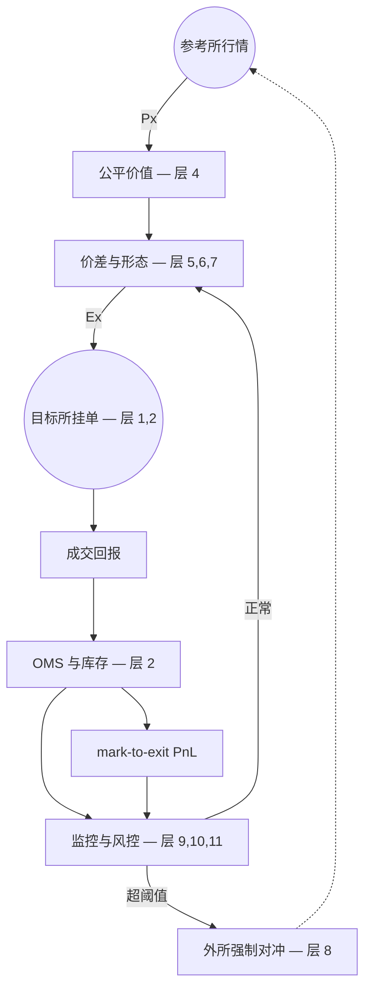

# 现货做市导读

> 本文档是项目的统一入口，目标是让任何人花十几分钟就能建立现货做市的整体认知：是什么、怎么赚、怎么亏、为什么这么分层、各层的延迟尺度。

---

## 1. 现货做市是什么

现货做市的本质是**持续在 bid 和 ask 两侧同时挂限价单，赚取 spread，承担库存风险**。你不预测方向，只赚"提供流动性"这件事本身的报酬。

涉及两个角色完全不同的交易所：

- **Target 所（做市所）**：你挂单、被成交、累积库存的地方。
- **Reference 所（参考所）**：你读取公平价的地方，通常是定价权最高的市场。

两者可以是同一个（self-quoting），也可以分开（cross-venue quoting，机构典型做法）。本项目以 cross-venue 为假设展开。

---

## 2. 怎么挣钱

收入主要来自两条：

**Spread capture**——一笔买（bid 被吃）配一笔卖（ask 被吃）完成一次 round-trip，毛利约等于 1 个 spread。spread 大小由你自己设定，但设得越宽越难成交。

**Maker rebate**——主流加密所给挂单方返佣，每笔成交都拿，量大时占总收入相当比例。

直觉上做市的收入 = 全部成交 × 半价差 + 全部成交 × 返佣，但实际拿到手要扣掉"被信息更快的对手吃掉"那部分损失（见 §3）。

**核心 insight**：做市赚不赚钱不取决于 spread 设多宽，而是**你的成交里有多少是 noise flow（出于流动性需求的随机买卖）**。Spread 收入是稳定的小钱，让 noise flow 占成交主体才是做市的真正 edge。

---

## 3. 怎么亏钱

亏损分两个独立来源：**单笔被毒单吃** 与 **库存单边累积**。两种都是真实可量化的成本，必须分开监控。

### 3.1 单笔 toxic fill（瞬时亏损）

被"信息上比你更快/更准"的对手成交后，mid 立刻朝你不利方向移动，这笔成交在 mark-to-market 意义上立刻为负——称为 **toxic fill**。

典型量级（mark-out @ 1s）：

| 市场状态 | 单笔损失 | 占 spread 比例 |
|---|---|---|
| 平静 | -0.3 ~ -0.5 tick | ~0.5× |
| 正常波动 | -0.5 ~ -1.0 tick | ~1.0× |
| 高波动 / 新闻 | -2 ~ -10 tick | 3-20× |
| 闪崩 / 极端事件 | -50 ~ -500 tick | 数量级 toxic |

五种来源（按频率与单笔损失大致递增）：

1. **跨所套利者**——最常见。reference 跳价后，套利机器人在你撤单之前吃掉你的旧报价。单笔不大但累积是 toxic loss 的最大头。
2. **HFT taker 策略**——基于 order flow / momentum 预判，主动吃你的报价，不在乎付 spread，要的是方向 alpha。
3. **大单冲击 / iceberg**——大客户分批同向下单，你刚补的报价又被吃，连续多笔同方向吞噬。
4. **新闻 / 公告驱动**——CPI、SEC、ETF 列币等消息发布瞬间，订阅机器人比人类快几百毫秒，一次极致 toxic。
5. **Insider / 内幕信息**——极低频、单次可吃掉一周 PnL，几乎无法事前防御，只能事后复盘。

### 3.2 库存单边累积（累积亏损 / latent loss）

更隐蔽的亏损方式：一侧报价**持续不被成交**，inventory 在另一侧单边累积，最终撞到 cap 触发外所强制对冲。

**关键认知**：账面在赚 ≠ 真在赚。把库存按 mid 估值（mark-to-mid）只是一种会计幻觉；只有按你**真实能退出的价格**估值（mark-to-exit）才反映真实可回收资金。

| 估值方法 | 含义 |
|---|---|
| **Mark-to-Mid** | 现金 + 库存按当前 mid 估值。假设可以无成本立即平仓——幻觉 |
| **Mark-to-Exit** | 现金 + 库存按"真实可退出价"估值（扣掉外所半价差、taker fee、size 滑点、跨所搬运成本）——真实可回收资金 |

只要库存非零，潜亏（latent loss）一直存在。当强制对冲发生，潜亏 → 实亏，账面突然下跳一个台阶——但**损失早就在累积**，只是之前没结算。

**做市的真实 PnL 永远要用 mark-to-exit 看**，同时盯住 inventory imbalance ratio（买卖成交方向不平衡度）。库存单边累积本身就是 adverse selection 的累积形式，比单笔 markout 更早暴露问题。

亏损可量化的几个核心方向：**成交后 mid 漂移**（被成交后价格朝你不利方向走了多少）、**实际赚到的 spread 占报价 spread 的比例**、**被毒单吃的成交比例**、**库存方向是否长期偏向某一侧**。这些指标共同构成做市损益的真实画像。

---

## 4. 系统分层

做市系统按依赖顺序拆成下面 11 层。**每一层都是上一层的前提**，不能跳级。每层只回答三个问题：**做什么 / 为什么必须有 / 没有它会怎样**。

### 1. 多场所市场数据基础设施层

- **做什么**：接 target 和 reference 所的 L2 / 成交 WS，本地维护实时订单簿镜像，处理时延对齐、序号校验、断线重连。
- **为什么必须有**：你"看到的市场"是所有策略的输入，数据错则下游全错。
- **没有它会怎样**：丢一个 sequence、订单簿挂漂移，所有决策都建立在幻觉之上。

### 2. 订单管理系统（OMS）层

- **做什么**：完整的订单状态机（Pending → Active → PartiallyFilled → Filled / Cancelled），处理 ghost fill，库存毫秒级同步。
- **为什么必须有**：订单和库存的会计不一致 = 资金错乱。
- **没有它会怎样**：撤单未确认就重挂、fill 回报漏处理 → 实际持仓和账面不符 → 风控失效。

### 3. Paper trading 层

- **做什么**：与生产完全同代码路径，但订单走模拟撮合，用真实行情驱动。
- **为什么必须有**：任何策略修改必须在不烧真钱的环境验证。
- **没有它会怎样**：每次改参都用真钱回测，事故只是时间问题。

### 4. 公平价值层

- **做什么**：从 reference 所行情计算公允价（含延迟补偿、basis 估计），输出"我相信现在市场公允价是多少"。
- **为什么必须有**：报价必须围绕一个稳定的公允锚，否则全部成交都是 toxic。
- **没有它会怎样**：spread 收入完全被 adverse selection 吃掉。

### 5. 价差层

- **做什么**：根据当前波动率、库存状态、市场状态，决定 bid/ask 的宽度与中心偏移。
- **为什么必须有**：spread 太窄被 toxic 吃；太宽不成交；不对库存反应则单边累积。
- **没有它会怎样**：要么没成交，要么持续被毒单吃。

### 6. 形态层

- **做什么**：在公允价附近决定挂哪几档、每档挂多大量，构造阶梯报价。
- **为什么必须有**：单档报价对大单冲击毫无防御；多档分散 toxic 风险。
- **没有它会怎样**：一笔大单吞掉全部 quote，单次损失远超日常 spread 收益。

### 7. LOB 结构感知层

- **做什么**：实时扫描 reference 所深度，识别流动性聚集点，把报价对齐到结构性位置，估计队列优先级。
- **为什么必须有**：撮合是严格 FIFO，队列位置决定成交优先级；挂错位置等于跟自己作对。
- **没有它会怎样**：始终排在不利位置，noise flow 全被前面的 MM 吃走。

### 8. 库存对冲层

- **做什么**：当 target 所累积库存超阈值，在外所主动平掉风险敞口。
- **为什么必须有**：单边库存累积是 latent loss，必须及时兑现成可控的对冲成本（见 §3.2）。
- **没有它会怎样**：撞 cap 才被动对冲，价格已经跑远，潜亏全部兑现成实亏。

### 9. 逆向选择监控层

- **做什么**：实时计算 mark-out、toxic ratio、realized vs quoted spread，识别毒性流量并触发降级。
- **为什么必须有**：toxic 累积是亏损主因，必须有 early warning，而不是事后归因。
- **没有它会怎样**：今天亏明天不知道为什么，无法迭代。

### 10. 极端市场状态检测层

- **做什么**：σ 突变、深度骤减、跨所价差异常的实时检测，自动触发拉宽 spread / 暂停报价 / 单边关停 / 完全 kill。
- **为什么必须有**：极端事件下正常参数全部失效，必须主动撤退而不是硬扛。
- **没有它会怎样**：一次 flash crash 吃掉几个月 PnL。

### 11. 风控硬约束层

- **做什么**：单边仓位上限、总仓位上限、日亏损上限、每秒下单频率限制、异常订单自动撤、kill switch。
- **为什么必须有**：所有上层失效后的最后兜底。
- **没有它会怎样**：任何 bug 都可能演变成灾难。

**依赖纪律**：层 1-3 是地基，层 4-7 是定价与流动性供给，层 8-11 是风险管理与执行优化。**任何一层没稳定就上下一层都是空中楼阁**——基础设施没做完就上定价是在沙地上盖楼；定价没稳就上风控只是用复杂参数掩盖结构问题。

---

## 5. 各层延迟

### 5.1 三条独立路径

| 路径 | 关心什么 | 健康量级 | 哪些层依赖 |
|---|---|---|---|
| **价格信号路径 [Px]** | reference 行情 → 看到新公平价 | 端到端 20-50 ms | 层 1（行情）、层 4（公平价值）、层 5（价差） |
| **订单执行路径 [Ex]** | 决策 → target 挂 / 撤单 ACK | 端到端 5-50 ms | 层 2（OMS）、层 8（对冲） |
| **共享基础设施 [Inf]** | 时钟同步、全链路打点、决策循环 | μs ~ 低 ms | 所有层 |

### 5.3 WebSocket vs REST：通道选择决定 2-3 倍延迟

做市的 hot path **永远走 WebSocket**，REST 只用于偶发操作（reconcile、查询余额、补全状态）。

| 通道 | 单次操作延迟 | 主要开销 | 适用场景 |
|---|---|---|---|
| **WS 行情推送** | 事件驱动，到达延迟 <= 100 ms | 持久连接，frame 解析极轻 | 唯一可行的行情通道 |
| **REST 行情轮询** | 受轮询间隔限制（≥200 ms） | 每次重新建连、HTTP 解析 | 几乎不用，仅用于初始 snapshot |
| **WS API 下单 / 撤单** | **2-10 ms** server-side | 持久连接，二进制 frame | **做市挂改撤主通道** |
| **REST 下单 / 撤单** | 5-30 ms server-side | 每次 TLS 握手、HTTP 头开销 | 仅用于批量操作、对账 |

为什么差 2-3 倍？

- **TLS / TCP 握手**：REST 每次请求都要握手（除非 keep-alive 完美，但实战中很难保证），WS 是一次握手长期持有。
- **HTTP 头与解析**：REST 每次请求几百字节的头部，WS frame 只有几字节 framing。
- **方向性**：WS 全双工，可以在同一条连接同时收行情和发订单；REST 是请求-响应单工。
- **撤改原子操作**：WS API 一般支持 `cancelReplace` / `amend-order` 原子操作，省去 cancel → ACK → new 的双 RTT；REST 实现这种操作的代价更高。

**最大杠杆是节点的物理部署位置**。把节点放到 target 所同区域可以把 RTT 从 100 ms 降到 2 ms，**任何代码层优化都比不上**。

**铁律**：stale price 是模型问题（可以加滞后补偿），stale cancel 是 PnL 漏洞（立刻吃 toxic）。**节点优先靠近 target，不是 reference**。

### 5.4 必须打点的数据

**没有打点就没有诊断**——任何"我觉得这里慢""我觉得这单是 toxic"都没有依据。必须在以下时间点记录纳秒级时间戳。

#### A. 延迟归因所需的全链路打点

按时序记录一笔报价从行情触发到 ACK 的完整时间线：

| 时刻 | 字段 | 含义 |
|---|---|---|
| 1 | `reference_recv_ts` | reference 所 WS frame 收取时刻 |
| 2 | `decode_ts` | 解析完成（JSON / 二进制 → 内存对象） |
| 3 | `book_update_ts` | 本地订单簿镜像更新完成 |
| 4 | `fair_price_ts` | 公平价计算完成 |
| 5 | `decision_ts` | 报价 / 撤单决策完成 |
| 6 | `send_ts` | 网络层 write 完成 |
| 7 | `target_ack_ts` | target 所返回 ACK |
| 8 | `target_match_ts` | 交易所撮合时间戳（来自 ACK / fill 回报） |

由这套打点可直接拆出：

- **Px 路径延迟** = `fair_price_ts` − `reference_recv_ts`
- **策略决策延迟** = `decision_ts` − `fair_price_ts`
- **Ex 路径延迟** = `target_ack_ts` − `decision_ts`
- **网络单程估计** = (`target_ack_ts` − `send_ts`) / 2
- **本地处理延迟** = `send_ts` − `decision_ts`

任何一段 P99 异常都能定位到具体路径，不会再"盲猜瓶颈"。

#### B. Toxic fill 归因所需的成交打点

每一个 fill 必须记下：

| 字段 | 含义 |
|---|---|
| `local_recv_ts` | 本地收到 fill 回报的时刻 |
| `target_match_ts` | target 所撮合时间戳 |
| `symbol`, `side`, `price`, `qty`, `fee` | 基础成交字段（`side` 用 MM 视角：bid 被吃 = buy） |
| `order_id` | 用于回溯挂单 |
| `quote_decision_ts` | 当初挂这单的决策时刻 |
| `fair_price_at_quote` | 挂单时刻的公平价（reference mid） |
| `fair_price_at_fill` | 成交瞬间的公平价（reference mid） |
| `queue_pos_estimate` | 成交前估计的队列位置 |

配合 **reference mid 高频快照（建议 1 Hz 或更密）**，事后可计算：

- **mark-out @ 任意 horizon**：成交后 100 ms / 1 s / 10 s / 60 s reference mid 朝有利或不利方向移动多少
- **单笔 toxic 损失**：`fair_price_at_quote` vs `fair_price_at_fill` 与成交价的对比
- **toxic fill ratio**：mark-out 为负的比例
- **延迟与 toxic 的相关性**：Ex 路径延迟高时 toxic ratio 是否上升

**没有这些字段，事后无法做任何归因，监控系统就只是装饰。**

#### C. 打点纪律

- **挂单瞬间就要记 `fair_price_at_quote`**，事后查不到当时的公平价。
- **打点写入必须异步 batch flush**，绝不能阻塞 hot path。

---

## 6. 整体流程图

闭环里每一个环节都有可能成为亏损来源：

- 价格信号慢 → 报价 stale → 被套利者吃成 toxic
- OMS 漏 fill → 库存错 → 风控失效
- 风控阈值不合理 → 强制对冲不及时 → latent loss 兑现成实亏

任何一层垮塌，整条闭环都会失效，所以分层不是"美观"，是"任何一环都不能省"。

