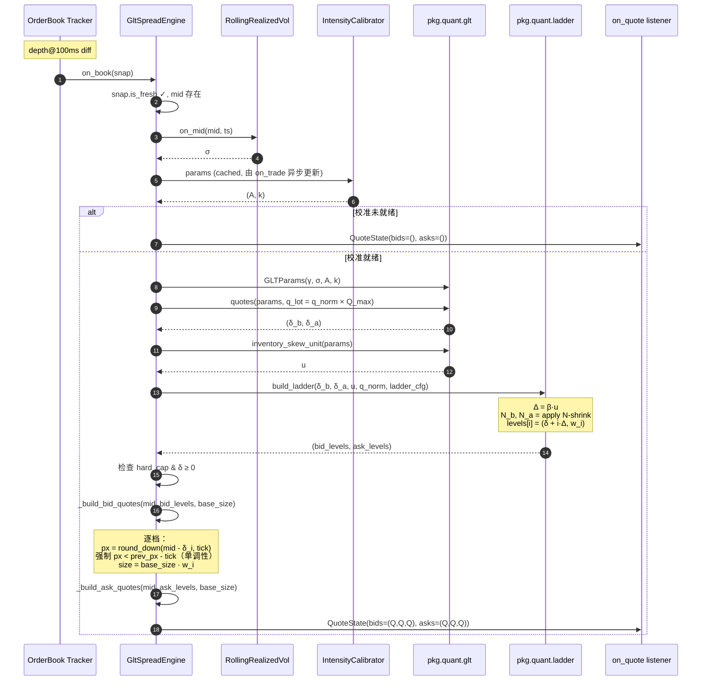
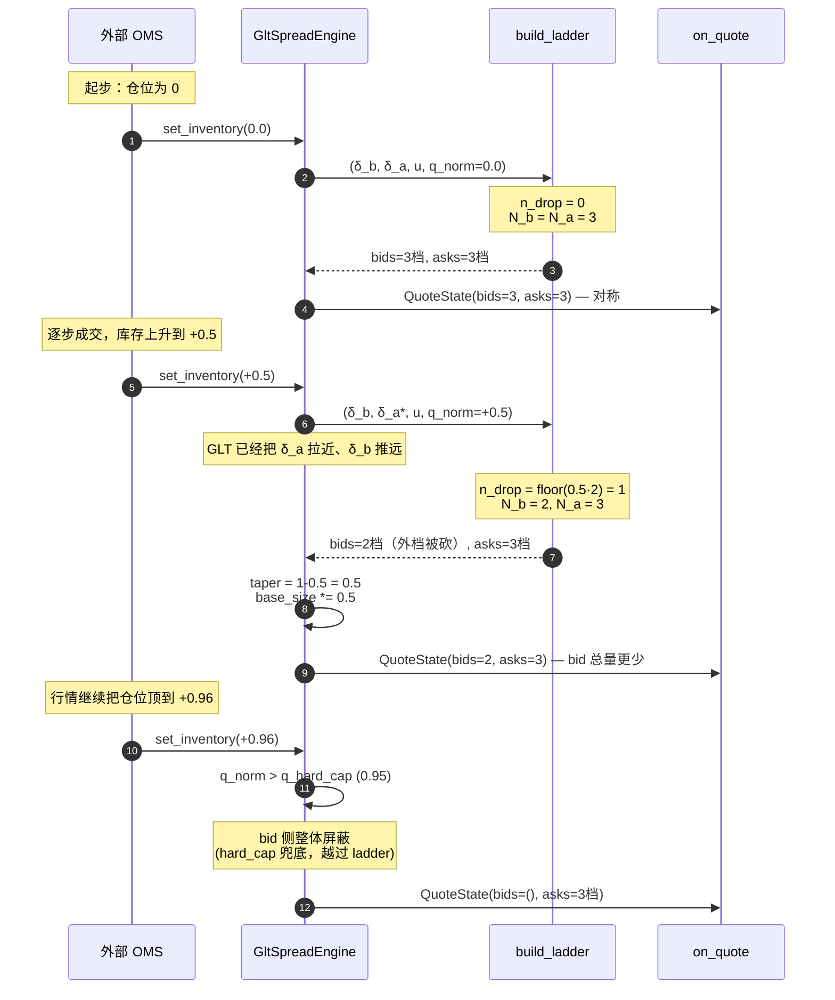
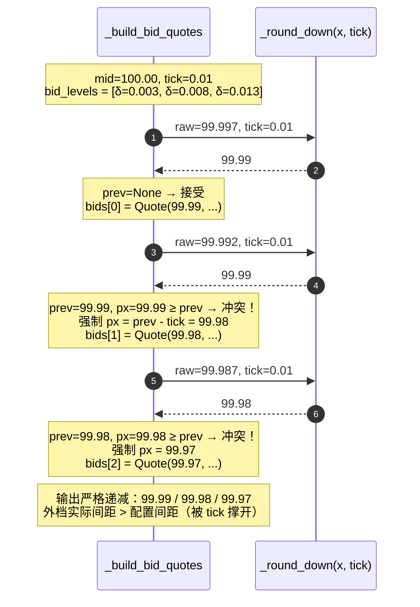
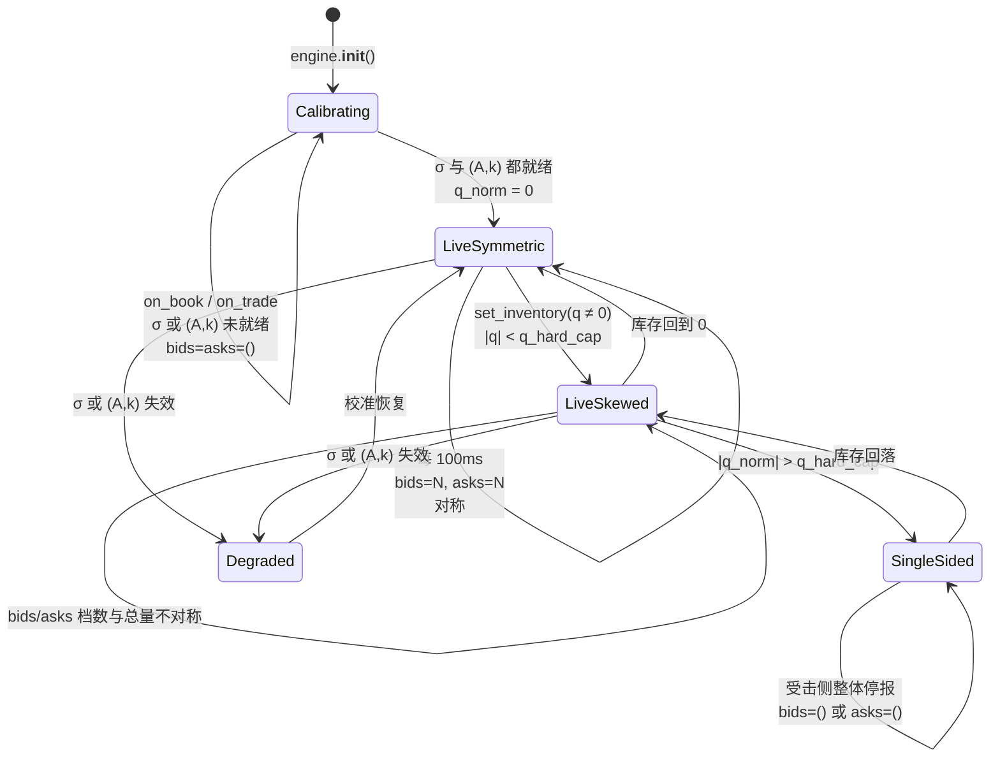

# Ladder 形态引擎设计与实现（MVP）

> 在 GLT 单档报价之上，把 (δ_b, δ_a) 扩成 N 档 ladder。
> 适用阶段一：单 symbol、单交易所、现货。
> 关联文档：[`glt_spread.md`](./glt_spread.md)。

---

## 1. 设计意图与边界

### 1.1 为什么需要 Ladder

`pkg/quant/glt.py:quotes()` 给出的是**单档最优**距离，即「如果你只能在一个价位挂单，挂在 mid ± δ 处最优」。
但实盘做市要：

- **吃 spread 区分层**：内档保住队头位置（FIFO 队列价值），外档承接行情打穿后的库存补给
- **风控形态化**：不同 `q_norm` 下需要的不只是「价位偏斜」，还需要「档数 / 总量 / 形态」上的非对称
- **rate-limit-aware**：N 档但要可控，不撞 Binance 50/10s 限速

### 1.2 MVP 的最少变量原则

按「先少变量、后逐步加」节奏，MVP 只动两个旋钮：

| 维度 | MVP 做 | 后续迭代 |
|---|---|---|
| 档数 N | ✅ 固定 `n_levels`，受击侧 N-shrink | 动态档数（按 σ/资本/rate-limit） |
| 档间距 Δ | ✅ 等距，Δ = β·u（跟随 GLT dispersion） | 几何递增 `Δ_i = Δ_0·ρ^i` |
| 量分配 | ✅ 固定权重 `(0.15, 0.30, 0.55)` 内薄外厚 | 参考所深度比例、信号加权 |
| 库存非对称 | ✅ 只通过 **N**（砍外档）和 **Q**（taper） | Δ skew、δ skew（**已由 GLT 公式负责，ladder 不重复**） |

**职责切分**：价位偏斜（bid/ask 不对称的距离）由 `pkg/quant/glt.py:quotes()` 负责；形态偏斜（档数 / 总量）由 `pkg/quant/ladder.py:build_ladder()` 负责。两个机制不重叠。

### 1.3 不做（明确边界）

- 不做 OMS 多档挂单（当前项目无 OMS，引擎只产 QuoteState）
- 不做几何档间距、不做 Δ 库存倾斜
- 不做参考所深度比例分配（多一个数据依赖、多一个失败点）
- 不做重报价迟滞带、batch cancel-replace 调度
- 不做跨档监控 metrics

---

## 2. 数学模型

### 2.1 输入

- $\delta_b, \delta_a$：来自 `quotes(params, q_lot)`，单位 price units
- $u$：来自 `inventory_skew_unit(params)`，price units，GLT dispersion magnitude
- $q_{\text{norm}} \in [-1, 1]$：归一化库存
- `LadderConfig`：`n_levels`、`delta_coef (β)`、`weights`、`n_shrink`

### 2.2 公式

档间距：

$$
\Delta = \beta \cdot u
$$

档数（受击侧 = 多头时 bid 侧、空头时 ask 侧）：

$$
n_{\text{drop}} = \min\!\big(\lfloor |q_{\text{norm}}| \cdot n_{\text{shrink}} \rfloor,\; n_{\text{levels}} - 1\big)
$$

$$
N_b = \begin{cases} n_{\text{levels}} - n_{\text{drop}}, & q_{\text{norm}} > 0 \\ n_{\text{levels}}, & \text{otherwise} \end{cases}
\quad
N_a = \begin{cases} n_{\text{levels}} - n_{\text{drop}}, & q_{\text{norm}} < 0 \\ n_{\text{levels}}, & \text{otherwise} \end{cases}
$$

每档距离与权重：

$$
\delta_{b,i} = \delta_b + i \cdot \Delta, \quad w_{b,i} = \text{cfg.weights}[i], \quad i = 0, \dots, N_b - 1
$$

$$
\delta_{a,i} = \delta_a + i \cdot \Delta, \quad w_{a,i} = \text{cfg.weights}[i], \quad i = 0, \dots, N_a - 1
$$

档间距统一来自 $u$ 的设计意味着：σ 上升 / 强度 A 下降时档间距自动放宽，外档自动被推远，无需手工调参——**ladder 形态跟着市况呼吸**。

### 2.3 量分配

引擎层定义：

$$
\text{base\_size} = \text{lot\_size} \cdot \text{taper}, \quad \text{taper} = \max(0,\, 1 - |q_{\text{norm}}|)
$$

每档实际量：

$$
\text{size}_i = \text{base\_size} \cdot w_i
$$

**关键设计点**：受击侧砍外档时**不**重新分配权重，剩余档的权重之和直接 < 1。这与 taper 形成「双重收缩」：

| 维度 | 影响范围 | 数学效果 |
|---|---|---|
| `taper = 1 - |q|` | 双侧总量 | 库存越满，两边总量同步收缩 |
| `N-shrink` | 仅受击侧 | 受击侧权重和 < 1，总量进一步缩水 |

合起来：受击侧总量 < 安全侧总量。这是机构常见做法——比再做一次权重归一化简单，且更保守（库存满时受击侧主动萎缩）。

### 2.4 不变量

- $\delta_{b,i+1} > \delta_{b,i}$（每侧 delta 严格单调递增）
- $q_{\text{norm}} = 0 \Rightarrow N_b = N_a$ 且每档对称
- $\sum_i w_i = 1$（cfg 校验）
- 受击侧至少保留 1 档（受 `n_drop ≤ n_levels - 1` 约束）；完全停报由引擎层 `q_hard_cap` 兜底

---

## 3. 模块架构

```
pkg/quant/
├── glt.py                     ← 已有：quotes() / inventory_skew_unit()
└── ladder.py                  ← 新增：LadderConfig / LadderLevel / build_ladder()

biz/domain/quote.py            ← 修改：QuoteState.bid/ask → bids/asks: tuple[Quote, ...]

biz/usecase/glt_spread.py      ← 修改：_recompute() 调 build_ladder + 单调性约束 + tick 取整

config/__init__.py             ← 扩展 SpreadConfig：4 个 ladder_* 字段

cmd/mm.py / cmd/watch_quote.py ← 修改：_fmt_side() 紧凑打印多档

etc/nano-mm.yaml               ← 增 ladder 段
```

### 3.1 分层契约

- **`pkg/quant/ladder.py`** 纯函数，零 I/O、零状态、零异常分支。输入 `(δ_b, δ_a, u, q_norm, cfg)`，输出两侧 `LadderLevel` 列表（distance + weight），价格转换 / tick 取整 / 硬上限**全部由调用方负责**。
- **`biz/usecase/glt_spread.py`** 持有状态机，编排 GLT + ladder + 价格转换。引擎是唯一知道 `mid`、`price_tick`、`q_hard_cap` 的层。
- **`biz/domain/quote.py`** 数据结构。`QuoteState.bids/asks` 始终为 `tuple[Quote, ...]`，空 tuple 表示该侧无报价（校准未就绪 / 硬上限触发 / cross-quote 屏蔽 三种情况合并）。

### 3.2 复用 GLT 已有函数

`inventory_skew_unit(params)` 在 `pkg/quant/glt.py:56` 已经存在并对外暴露——ladder 直接调用拿 $u$，**不重复计算**。

---

## 4. 时序图

### 4.1 单 tick 报价流（稳态运行）



### 4.2 库存上升的形态演化

> 演示 `q_norm` 从 0 → +0.5 → +0.96 时 ladder 如何呼吸。
> 配置：`n_levels=3, n_shrink=2, q_hard_cap=0.95`。



### 4.3 Tick 取整下的单调性约束

> 在窄 spread / 大 tick 场景下，多档算出的连续价格可能向同一 tick 取整。
> 单调性约束保证 ladder 中价格严格分开，避免 OMS 收到重复价位订单。



### 4.4 build_ladder 决策流程（纯函数内部）

```mermaid
flowchart TD
    Start([输入: δ_b, δ_a, u, q_norm, cfg]) --> Step[Δ = cfg.delta_coef · u]
    Step --> Inv{q_norm > 0?}
    Inv -->|是| HitBid[hit_side = bid<br/>n_drop = floor &#124;q&#124;·n_shrink<br/>N_b = n_levels - n_drop<br/>N_a = n_levels]
    Inv -->|q_norm < 0| HitAsk[hit_side = ask<br/>N_a = n_levels - n_drop<br/>N_b = n_levels]
    Inv -->|q_norm = 0| Flat[N_b = N_a = n_levels]

    HitBid --> Clip[n_drop = min n_drop, n_levels-1<br/>保证至少 1 档]
    HitAsk --> Clip
    Flat --> Clip

    Clip --> Gen[bids_i = LadderLevel<br/>delta=δ_b + i·Δ, weight=w_i<br/>for i in range N_b]
    Gen --> Gen2[asks_j = LadderLevel<br/>delta=δ_a + j·Δ, weight=w_j<br/>for j in range N_a]
    Gen2 --> End([返回 bids, asks])
```



### 4.5 冷启动到首次多档报价



---

## 5. 关键不变量与边界处理

| 不变量 | 实现位置 | 触发场景 |
|---|---|---|
| `bids/asks` 内 delta 单调递增 | `build_ladder` 按 i 累加 Δ | 永远成立 |
| `bids` 价格严格递减、`asks` 严格递增 | `_build_bid_quotes` / `_build_ask_quotes` 单调性强制 | tick 取整后冲突时强制错开 |
| `max(bids.price) < mid < min(asks.price)` | δ_b, δ_a ≥ 0（cross-quote 检测 + ladder 单调扩展） | 永远成立 |
| 受击侧至少保留 1 档（在 hard_cap 未触发前） | `n_drop ≤ n_levels - 1` | 永远成立 |
| 校准未就绪 → 双侧空 | `_empty_state` | 启动 30-60s |
| 硬上限触发 → 受击侧整体空 | `bid_active / ask_active` | `q_norm > q_hard_cap` |
| Cross-quote (δ < 0) → 该侧整体空 | `bid_active / ask_active` 检查 `delta_b/a >= 0` | γ/Q_max 严重失配 |

---

## 6. 配置（`etc/nano-mm.yaml`）

```yaml
spread_engine:
  # ... GLT 字段（gamma / Q_max / lot_size / q_hard_cap / vol / intensity / price_tick）

  ladder_n_levels: 3
  ladder_delta_coef: 0.5         # Δ = 0.5 · u
  ladder_weights: [0.15, 0.30, 0.55]
  ladder_n_shrink: 2
```

### 调参建议

| 现象 | 怀疑参数 | 调法 |
|---|---|---|
| 外档很少成交 | `delta_coef` 太大 | 降到 0.3-0.4 |
| 外档被频繁 toxic fill | `delta_coef` 太小 / weights 外档过重 | 升 delta_coef 到 0.7-1.0 或权重前移 |
| 库存满时 bid 还在挂 | `n_shrink` 太小 / `q_hard_cap` 太松 | 加 n_shrink 到 `n_levels-1`，或紧 q_hard_cap 到 0.9 |
| 报价频率过高 / 撞 rate limit | `n_levels` 太大 / 缺重报价迟滞带 | 降 n_levels 到 2 或加迟滞（后续迭代） |

---

## 7. 测试

文件：`tests/unit/test_ladder.py`（19 个用例）

### 7.1 配置校验
- `test_weights_length_mismatch_raises`
- `test_weights_sum_must_be_one`
- `test_negative_weights_rejected`
- `test_n_levels_must_be_positive`
- `test_delta_coef_must_be_nonneg`
- `test_n_shrink_must_be_in_range`

### 7.2 形态不变量
- `test_symmetric_when_flat`：q=0 时 bid/ask 镜像
- `test_monotonic_deltas`：每侧 delta 严格递增
- `test_weight_sums_when_no_shrink`：无库存收缩时和为 1
- `test_step_equals_delta_coef_times_u`：Δ = β·u
- `test_step_scales_linearly_with_u`：u 翻倍 → Δ 翻倍
- `test_inner_level_starts_at_glt_delta`：内档 = GLT 给的 δ
- `test_zero_u_collapses_to_single_distance`：u=0 时所有档同距

### 7.3 库存非对称
- `test_long_inventory_shrinks_bid_levels`：q=+1, n_shrink=2 → N_b=1
- `test_short_inventory_shrinks_ask_levels`：q=-1, n_shrink=2 → N_a=1
- `test_partial_inventory_partial_shrink`：q=+0.5, n_shrink=2 → N_b=2
- `test_at_least_one_level_remains_on_hit_side`：n_drop 被 clip
- `test_no_shrink_config_keeps_all_levels`：n_shrink=0 时与库存无关
- `test_safe_side_unaffected_by_inventory`：安全侧档数与 delta 不变

### 7.4 跑测

```bash
uv run pytest tests/unit/test_ladder.py -q
# 19 passed

uv run pytest -q
# 78 passed (59 旧 + 19 新)
```

---

## 8. 端到端验证

```bash
uv run python -m cmd.watch_quote BTC_USDT
```

**预期输出**：

校准期（前 ~60s）：
```
BTC_USDT   mid=68423.5000  calibrating s=0.0000 A=0.00 k=0.0000
```

校准就绪：
```
BTC_USDT   mid=68423.50  bid=[3]68422.95/68421.80/68420.10 Σ0.001  ask=[3]68424.05/68425.20/68426.90 Σ0.001  s=1.234 A=42.3 k=0.0012 q=+0.00
```

注入 `set_inventory(+0.6)`：
```
BTC_USDT   mid=68423.50  bid=[2]68421.20/68419.50 Σ0.0004     ask=[3]68423.80/68424.95/68426.65 Σ0.0008    s=1.234 A=42.3 k=0.0012 q=+0.60
```
- bid 侧档数从 3 → 2（n_drop = floor(0.6·2) = 1）
- 两侧总量都缩了（taper = 0.4）
- bid 价整体推远（GLT δ_b 拉远）、ask 价整体拉近（GLT δ_a 收紧）

注入 `set_inventory(+0.96)`（触发 hard cap）：
```
BTC_USDT   mid=68423.50  bid=  -                            ask=[3]68423.55/68424.70/68426.40 Σ0.00004   s=1.234 ... q=+0.96
```
- bid 整体停报

---

## 9. 实现要点速查

| 关注点 | 文件 / 行号 |
|---|---|
| 纯算法入口 | `pkg/quant/ladder.py:build_ladder` |
| 配置校验 | `pkg/quant/ladder.py:LadderConfig.__post_init__` |
| GLT u 复用 | `pkg/quant/glt.py:inventory_skew_unit` |
| 引擎接入点 | `biz/usecase/glt_spread.py:_recompute` |
| 价格构造与单调性 | `biz/usecase/glt_spread.py:_build_bid_quotes / _build_ask_quotes` |
| 硬上限 / cross-quote 判定 | `biz/usecase/glt_spread.py:_recompute`（`bid_active / ask_active`） |
| QuoteState 形态 | `biz/domain/quote.py:QuoteState`（`bids/asks: tuple[Quote, ...]`） |
| 配置字段 | `config/__init__.py:SpreadConfig`（`ladder_*`） |
| YAML 默认值 | `etc/nano-mm.yaml:spread_engine` |
| 单测 | `tests/unit/test_ladder.py` |
| 打印 | `cmd/watch_quote.py:_fmt_side` / `cmd/mm.py:_fmt_side` |

---

## 10. 后续迭代路线

按「一次一个变量」节奏，按价值排序：

1. **重报价迟滞带**：价格移动 < 1 tick 时不重报，把 `cancelReplace` 频次压到 rate limit 之下。**优先级最高**——任何加阶都得先解决 rate limit。
2. **几何档间距 `Δ_i = Δ_0 · ρ^i`**：外档进一步推远，匹配真实订单簿「近密远疏」形态。
3. **Δ 库存倾斜**：受击侧 Δ 拉宽，与 N-shrink 形成「双重稀疏」。
4. **参考所深度比例**（仅 cross-venue 场景）：weights 跟随 reference book 累计深度。
5. **动态 N**：根据 σ 与 rate-limit 余量自动调档数。
6. **OMS 多档挂单**：把 QuoteState 翻译成 N 笔 Exchange API 调用，处理 ghost fill 与 partial fill。**这一步开始就要打全链路打点**（`fair_price_ts → decision_ts → target_ack_ts → fill_ts`）。

每加一个变量前，先看现有 ladder 在 1-2 周实盘下 PnL 与 fill 分布是否符合预期；不符合就回退到上一稳态调参，不要叠加新变量。
