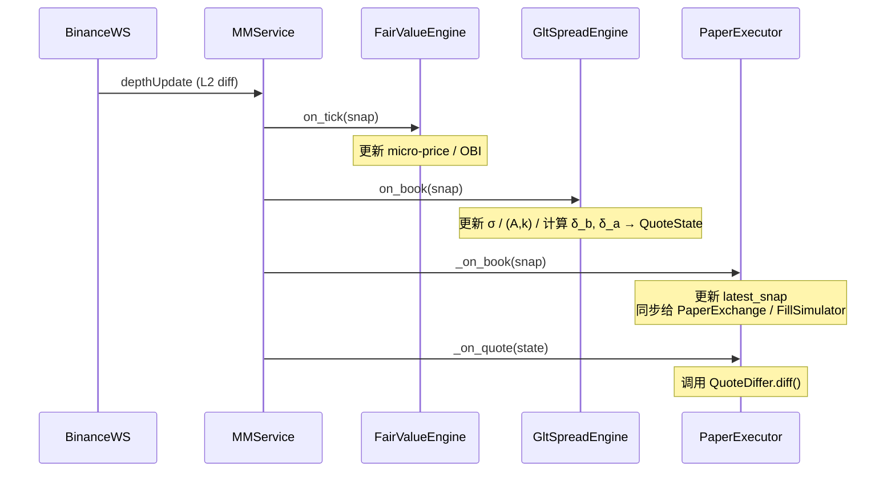
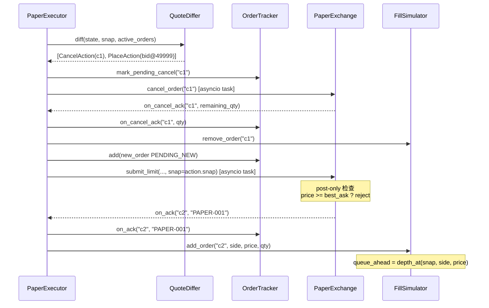
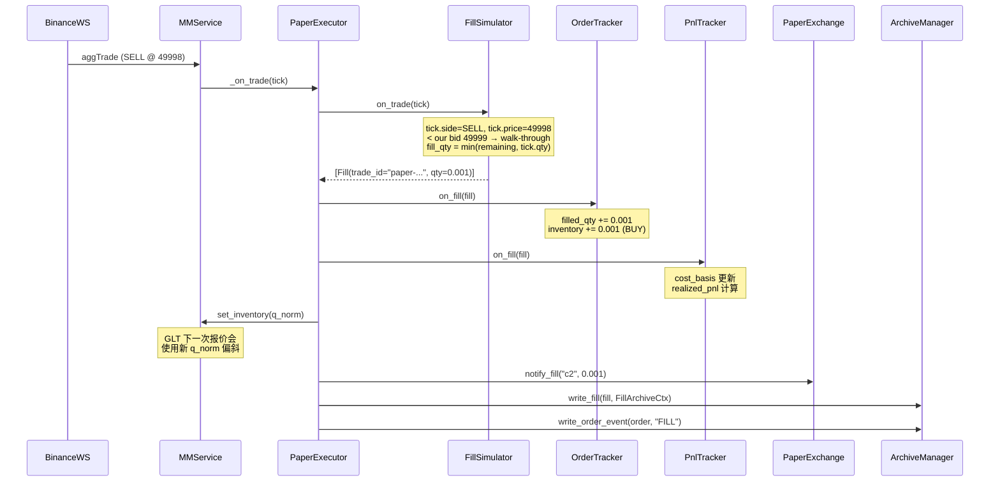
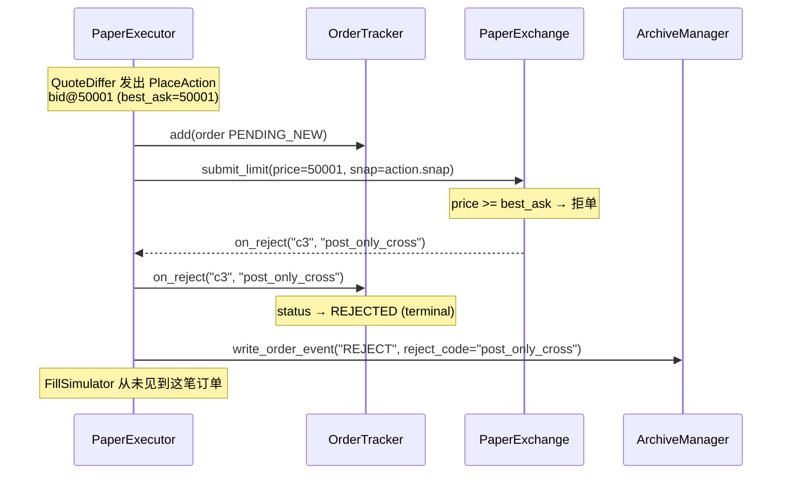

# Paper Executor 设计文档

> 一句话定位：用真实行情驱动 GLT 策略完整闭环，但所有订单在内存中模拟成交，不触碰真实交易所账户。  
> 入口：`uv run python -m cmd.paper_mm BTC_USDT`

---

## 1. 为什么需要 Paper Executor

Phase 1 的 `cmd/mm.py` 止步于 `QuoteState` 打印——GLT 的库存偏斜项 `q_norm` 永远是 0，填报单→成交→更新库存→改变报价 的完整回路从未走通。

Paper Executor 补上最后一段路：

| 缺口 | Paper Executor 补充的能力 |
|---|---|
| GLT 库存偏斜从未生效 | 每次模拟成交后更新 q_norm → 回传 `MMService.set_inventory()` |
| 没有 PnL / markout 数据 | 所有订单、事件、成交写入同一套 archive（SQLite + Parquet） |
| 上线前没有回归床 | 可在真实行情上完整 replay，不需要历史数据 |

---

## 2. 组件一览

```
┌─────────────────────────────────────────────────────────────┐
│                        MMService                            │
│  BinanceSpotOrderBookTracker  ──► FairValueEngine           │
│                               ──► GltSpreadEngine           │
│  BinanceSpotTradeTracker      ──► on_trade                  │
└──┬──────────────────┬───────────────────────┬───────────────┘
   │ book_listener    │ quote_listener        │ trade_listener (新增)
   ▼                  ▼                       ▼
┌─────────────────────────────────────────────────────────────┐
│                    PaperExecutor                            │
│                                                             │
│  ┌────────────┐  ┌──────────────┐  ┌────────────────────┐  │
│  │QuoteDiffer │  │ PaperExchange│  │  FillSimulator     │  │
│  │(pure func) │  │(ExchangeRepo)│  │  (strict FIFO)     │  │
│  └────────────┘  └──────────────┘  └────────────────────┘  │
│                                                             │
│  ┌────────────┐  ┌──────────────┐                          │
│  │OrderTracker│  │  PnlTracker  │                          │
│  │  (OMS)     │  │ (avg-cost)   │                          │
│  └────────────┘  └──────────────┘                          │
└─────────────────────────────────────────────────────────────┘
         │
         ▼
  ArchiveManager (SQLite + Parquet)
```

| 组件 | 文件 | 职责 |
|---|---|---|
| `QuoteDiffer` | `biz/usecase/quote_differ.py` | 纯函数；diff 期望 ladder vs 当前活跃订单 → cancel/place 动作列表 |
| `PaperExchange` | `data/exchange/paper.py` | 实现 `ExchangeRepo`；同步 ACK/拒绝/cancel ACK；post-only 检查 |
| `FillSimulator` | `biz/usecase/fill_simulator.py` | 严格 FIFO 队列模型；对接公开成交流 → 生成 Fill |
| `PaperExecutor` | `service/paper_executor_service.py` | 编排所有组件；库存反馈；archive 写入 |
| `PnlTracker` | `service/paper_executor_service.py` | 平均成本法实现盈亏计算 |
| `OrderTracker` | `data/exchange/oms.py` | 复用现有 OMS 状态机，不修改 |
| `cmd/paper_mm.py` | `cmd/paper_mm.py` | 程序入口 |

---

## 3. 时序图

### 3.1 行情到报价（每次 L2 tick）



### 3.2 报价差异处理（QuoteDiffer → PaperExchange → OrderTracker）



### 3.3 成交模拟（公开成交流 → Fill → 库存更新）



### 3.4 Post-only 拒单流程



---

## 4. 成交模拟规则（严格 FIFO）

### 4.1 关键变量

| 变量 | 含义 | 何时赋值 |
|---|---|---|
| `price` | 挂单价格 | `add_order` 时 |
| `remaining_qty` | 剩余未成交量 | 每次 fill 后递减 |
| `queue_ahead` | 挂单价位上我们前面的可见深度 | `add_order` 时从 `OrderBookSnapshot` 读取 |

### 4.2 每笔 aggTrade 的处理逻辑

```
对每个 resting 挂单:

BUY 挂单 @ price_us, SELL aggressor @ price_trade:
  if price_trade > price_us:  不影响我 (对手走得更差)
      skip

  if price_trade < price_us:  walk-through — 我的价位已被扫穿
      fill_qty = min(remaining_qty, tick.qty)
      queue_ahead = 0

  if price_trade == price_us:  正好打到我的价位
      if tick.qty <= queue_ahead:
          queue_ahead -= tick.qty   # 队列还没到我
      else:
          residual = tick.qty - queue_ahead
          queue_ahead = 0
          fill_qty = min(remaining_qty, residual)

SELL 挂单: 完全对称 (BUY aggressor)
```

### 4.3 已知局限性（v1 不修复）

- `queue_ahead` 只在提交时快照，撤单造成的队头缩短不被感知（保守估计，paper 成交率偏低）
- Paper 订单是"幽灵"——不插入真实 LocalOrderBook，不影响其他订单的 `queue_ahead`
- Walk-through 成交量上限为 `tick.qty`，不追踪走单后的残余量到下一档

---

## 5. QuoteDiffer 匹配规则

```
量化价格: price_int = round(price / price_tick)
量化数量: qty_int  = round(qty / qty_step)

对每个 (side, price_int) 组合:
  ┌ 在 active 中找到 qty_int 完全一致 且 状态非 PENDING_CANCEL?
  │   → KEEP (保留队列位置，不发送任何动作)
  │
  ├ 在 active 中有该 price_int 但 qty 不同?
  │   → Cancel 旧单 + Place 新单
  │
  └ active 中无此 price_int?
      → Place 新单
      (若该 key 已有 PENDING_NEW 则跳过，避免重复挂单)

active 中有但 desired 中无的 key:
  → Cancel 全部
```

**设计决策**：使用量化后的整数精确比较，不用浮点容差窗口——容差窗口会掩盖定价 bug 并在边界处抖动。

---

## 6. 库存反馈路径

```
Fill 到达
  │
  ├─► OrderTracker.on_fill()
  │     inventory += qty (BUY) 或 -= qty (SELL)
  │
  ├─► PnlTracker.on_fill()
  │     avg_cost 更新, realized_pnl 计算
  │
  └─► q_norm = clip(inventory / Q_max, -1, 1)
        │
        └─► MMService.set_inventory(q_norm)
              │
              └─► GltSpreadEngine._q_norm = q_norm
                    下次 on_book() 时:
                    - δ_b, δ_a 由 GLT 公式重新计算（包含库存偏斜项）
                    - bid 侧 n_shrink 减少外档（当 q_norm > 0 时）
```

---

## 7. Archive 写入时机

| 事件 | SQLite 表 | 调用时机 |
|---|---|---|
| 新订单提交 | `orders` | `_dispatch_place()` 中，submit 前 |
| 订单状态变更 | `order_events` | ADD / ACK / REJECT / CANCEL_ACK / FILL 各一行 |
| 成交 | `fills` | `_apply_fill()` 中，每笔 fill |
| Markout 回填 | `fills`（已有行更新） | `MarkoutBackfillTask` 后台定时（不由 executor 触发） |

`FillArchiveCtx` 中必须填写的关键字段（NULL 会破坏下游分析）：

```
inventory_before / inventory_after / q_norm_after
realized_pnl_after / unrealized_pnl_at_fill
is_ghost_fill / is_maker
queue_ahead_at_submit / book_seq_at_submit
```

---

## 8. 配置说明

在 `etc/nano-mm.yaml` 的 `paper:` 节中：

```yaml
paper:
  qty_step: 0.00001    # 最小下单单位（BTC 默认；换交易对时修改）
  maker_fee_bps: 0.0   # maker 手续费率（bps）；负数 = rebate；v1 默认 0
  initial_q_norm: 0.0  # 启动时喂给 GLT 的初始归一化库存
```

`spread_engine.price_tick` 同样影响 QuoteDiffer 的价格量化精度，务必与实际交易对一致（BTC/USDT 默认 `0.01`）。

---

## 9. 快速验证

```bash
# 启动 paper MM（实时行情，Ctrl-C 停止）
uv run python -m cmd.paper_mm BTC_USDT

# 观察要点：
# 1. 标定完成后（约 30~60s）出现 bid/ask ladder 输出
# 2. BTC mid 穿越我们的某个价位后，终端打印 paper_fill + 新 q_norm
# 3. q_norm 变化后，下一行 ladder 的内外档间距或层数会变化

# 查询成交记录
sqlite3 logs/sqlite/nano-mm.db \
  "SELECT trade_id, side, price, qty, inventory_after, q_norm_after, realized_pnl_after
   FROM fills ORDER BY recv_ts_ns DESC LIMIT 10"

# 查询订单事件链
sqlite3 logs/sqlite/nano-mm.db \
  "SELECT client_order_id, seq, event_type, status_after
   FROM order_events ORDER BY ts_ns LIMIT 20"
```

---

## 10. 扩展方向（Phase 2+）

| 方向 | 当前占位 |
|---|---|
| 延迟模拟 | `PaperConfig.ack_latency_ms`（待加）；现在 ACK 是同步的 |
| queue 缩短感知 | `FillSimulator` 可接收 book diff 更新 `queue_ahead`（v1 保守不做） |
| 费用模型 | `maker_fee_bps` 已在 config，`_apply_fill` 里加一行即可 |
| 实盘切换 | 将 `PaperExchange` 替换为真实 `ExchangeRepo` 实现，其余不变 |
| Replay 模式 | FillSimulator 接收历史 trade tape → 完全离线回测 |
